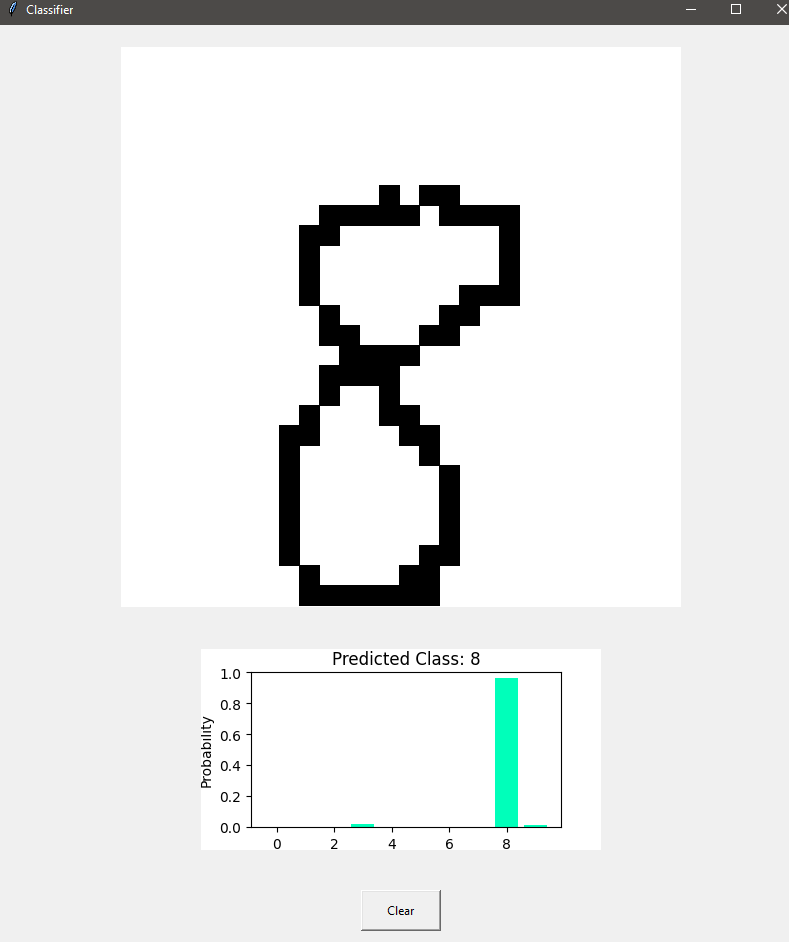

# Real-Time Handwritten Digit Classifier from Scratch (No TensorFlow or PyTorch)

An interactive, real-time MNIST digit classifier from scratch. No TensorFlow or PyTorch, just NumPy. Digits can be drawn in the GUI and will be classified in real time.

This project uses some code from "NeuralNetworkFromScratch" (https://github.com/Bot-Academy/NeuralNetworkFromScratch) by Bot Academy.
